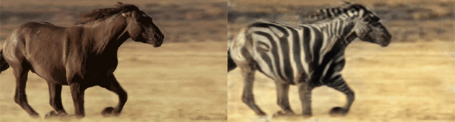
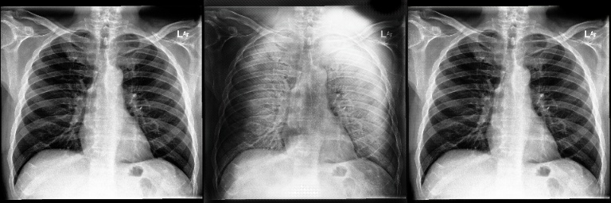
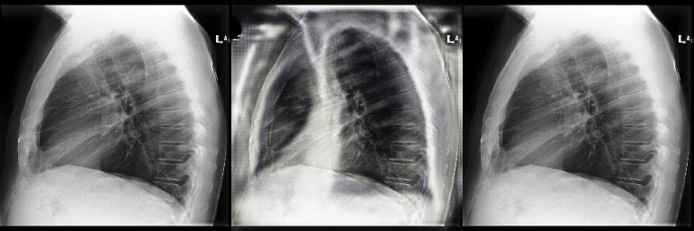

<!-- <hr style="height:1px" /> -->

<!-- <p align="center">  </p> -->

<!-- <hr style="height:1px" /> -->

<!-- # `<p align="center">` CycleGAN - Tensorflow 2 `</p>` -->

## Note for the supervisors

UNet Architecture problems:

- You have discussed about I use the same input figures for all plot. I am sure that I do not use the same images. You can check from test.py

PSNR and SSIM errors:

- The PSNR and SSIM calculatiation will be done in restore.py. You can check the implementation from this file
- The plotting figures result will be in plot.py file.
- I have checked all the codes again from the suggestion of the professor Serkan. But I recognize that there is nothing to debug. Therefore I belive that the model has the characteristic like that, not because of the problems from the code.
- Moreover, you can recheck the plot results for each epoch for the validation/training dataset in the zip file/plot_figures/psnr or ssim/ png file
- UNet architecture is inheriting from [docs/site/en/tutorials/generative/pix2pix.ipynb at master · tensorflow/docs (github.com)](https://github.com/tensorflow/docs/blob/master/site/en/tutorials/generative/pix2pix.ipynb), which is also the model architecture from [CycleGAN  |  TensorFlow Core](https://www.tensorflow.org/tutorials/generative/cyclegan).
- ResNet architecture is inheriting from [CycleGAN-Tensorflow-2/train.py at master · LynnHo/CycleGAN-Tensorflow-2 (github.com)](https://github.com/LynnHo/CycleGAN-Tensorflow-2/blob/master/train.py)

<!-- # CycleGAN - Tensorflow 2
Tensorflow 2 implementation of CycleGAN.
Paper: [Unpaired Image-to-Image Translation using Cycle-Consistent Adversarial Networks](https://arxiv.org/pdf/1703.10593.pdf)
Author: [Jun-Yan Zhu ](https://people.eecs.berkeley.edu/~junyanz/) *et al.*
## Example results
<p align="center">  </p>
<p align="center">  </p> -->

## Usage

- Software environment:

  ```console
  # Python with the following version and libraries.
  conda create -n r2c-gan python=3.7.11
  conda activate r2c-gan
  conda install tensorflow-gpu=2.4.1
  conda install scikit-image tqdm scikit-learn pydot
  conda install -c conda-forge oyaml
  pip install tensorflow-addons==0.13.0
  pip install numpy==1.19.2
  ```
- Dataset

  ```console
  sh ./download_dataset.sh CheXpert
  ```
- Example of training

  ```console
  python train.py
  ```

  - tensorboard for loss visualization
    ```console
    tensorboard --logdir ./output/summaries --port 6006
    ```
- Example of evaluating PSNR and SSIM values

  ```console
  python restore.py --method .... (which now can be convolutional, operational, unet, operational_unet)
  ```
- Example of plotting the generator, discriminator, cycle, identity loss, psnr, ssim

  ```console
  python plot.py 
  # there will me a popup for asking which architecture and how many epochs 
  # (which now can be convolutional, operational, unet, operational_unet)
  ```
- Example of plotting the adversarial, total loss and testing

  ```console
  python test.py --method.... (which now can be convolutional, operational, unet, operational_unet) --... (you can look at the param from the test.py help)
  ```
- Example of testing

  ```console
  python test.py --method ......
  ```

## Code functionality

- train.py - train the model and saving the generator, discriminator, cycle, identity loss of the model
- restore.py - restore the model and calculate the PSNR and SSIM values
- restore_plot - restore the plot of the model after 5 iterations to show the training process
- restore_reverse.py - restore the model and calculate the PSNR and SSIM values for the reverse direction
- plot.py - plot the generator, discriminator, cycle, identity loss, psnr, ssim
- test.py - plot the adversarial, total loss and testing the model
- evaluation/utils.py - contains the functions for calculating the PSNR and SSIM values, and the functions for plotting the generator, discriminator, cycle, identity loss, psnr, ssim
- test_all.py - plot all the models inside 1 image

## Result

- The result will be saved in the `./output/method` directory.
- The output will be saved in this [link ](https://tuni-my.sharepoint.com/:f:/g/personal/long_nguyen_tuni_fi1/Ej4N5AM4DppGtq3HgBeM49oB-ULsnVnhxFzp78ykStmlow?e=XuLvBO)
